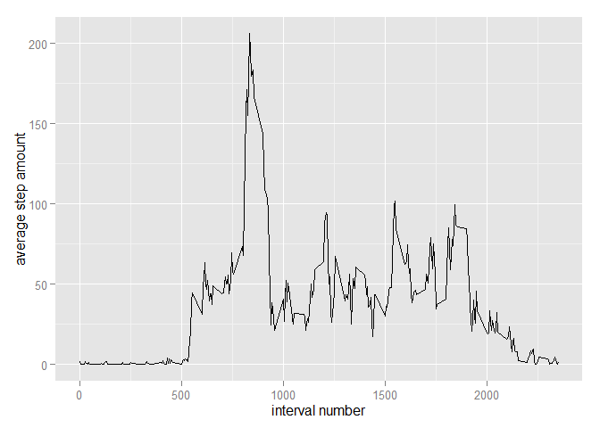

# Reproducible Research - Course Project 1
15 February 2016  

In this assignment we are working with data as would be gathered by an acitivity monitoring device, such as a Fitbit, Nike Fuelband etc. The data we process here consists of two months data from such a device which is collected at 5 minute intervals during the day.

The variables included in this dataset are:

* steps: Number of steps taking in a 5-minute interval (missing values are coded as NA)
* date: The date on which the measurement was taken in YYYY-MM-DD format
* interval: Identifier for the 5-minute interval in which the measurement was taken

## Loading and preprocessing the data

For this project we include two packages listed here:

```r
library(ggplot2)
library(dplyr)
```

and then read in the activity file, supplied in the assignment github repository

```r
activity <- read.csv("activity.csv")
```

## Mean total number of steps taken per day

We first sum the number of steps corresponding to a particular day,

```r
aggDate <- aggregate(activity$steps,list(day = activity$date),sum, na.rm = TRUE)
```

and plot a histogram of steps taken

```r
qplot(aggDate$x, geom = "histogram") + ggtitle("Histogram of steps taken") + xlab("steps") 
```


From the "aggDate" data we can also find the mean and median of the total number of steps taken per day, seen in the summary of the data

```r
summary(aggDate$x, na.rm = TRUE)
```

```
##    Min. 1st Qu.  Median    Mean 3rd Qu.    Max. 
##       0    6778   10400    9354   12810   21190
```

## Average daily activity pattern

We take the mean of the number of steps taken corresponding to a particular interval

```r
aggInterval <- aggregate(activity$steps, list(interval = activity$interval), mean, na.rm = TRUE)
```

and plot a time series showing interval (x-axis) and the average number of steps taken, averaged across all days (y-axis).

```r
ggplot(data = aggInterval, aes(interval, x)) + geom_line() + xlab("interval number") +
              ylab("average step amount")
```



The interval which, on average over all days, records the most steps is

```r
aggInterval$interval[which.max(aggInterval$x)]
```

```
## [1] 835
```

## Imputing missing values

To begin we build the vector "my.na" which records the NA values in the "steps" column of the "activity" dataset.

```r
my.na <- is.na(activity$steps)
```

From this we can find the number of NA values

```r
sum(my.na)
```

```
## [1] 2304
```

Here, we replace the NA "step" values for an interval in the "activity" dataframe with average steps calculated using all other days in the same interval

```r
avgValues <- do.call("rbind", replicate(61, aggInterval, simplify = FALSE)) # There are 61 days
activity$steps[my.na] <- avgValues$x[my.na]
```

We can repeat the steps taken in Step 2 to create a histogram

```r
aggDate <- aggregate(activity$steps,list(day = activity$date),sum, na.rm = TRUE)
qplot(aggDate$x, geom = "histogram") + ggtitle("Histogram of steps taken") + xlab("steps") 
```


and find the mean and median of the total number of steps taken per day

```r
summary(aggDate$x, na.rm = TRUE)
```

```
##    Min. 1st Qu.  Median    Mean 3rd Qu.    Max. 
##      41    9819   10770   10770   12810   21190
```

## Differences in activity patterns between weekdays and weekends

First we create another variable in the "activity" dataset that distinguishes weekdays and weekends from the dates in the "date" column

```r
activityweek <- mutate(activity, Day = {ifelse (weekdays(as.Date(date)) %in% c('Saturday','Sunday'),
                                            "weekend", "weekday")})
```

We then take the mean of the number of steps taken corresponding to a particular interval conditioned
on whether it is a weekday / weekend

```r
aggWeek <- aggregate(activityweek$steps, list(interval = activityweek$interval,
                                                day = activityweek$Day), mean)
```

Here we plot the 5-minute interval (x-axis) vs. the average number of steps taken, averaged across all weekdays / weekends (y-axis).

```r
ggplot(data = aggWeek, aes(interval, x)) + facet_grid(day ~.) + geom_line() + xlab("interval number") + ylab("average step amount")
```


